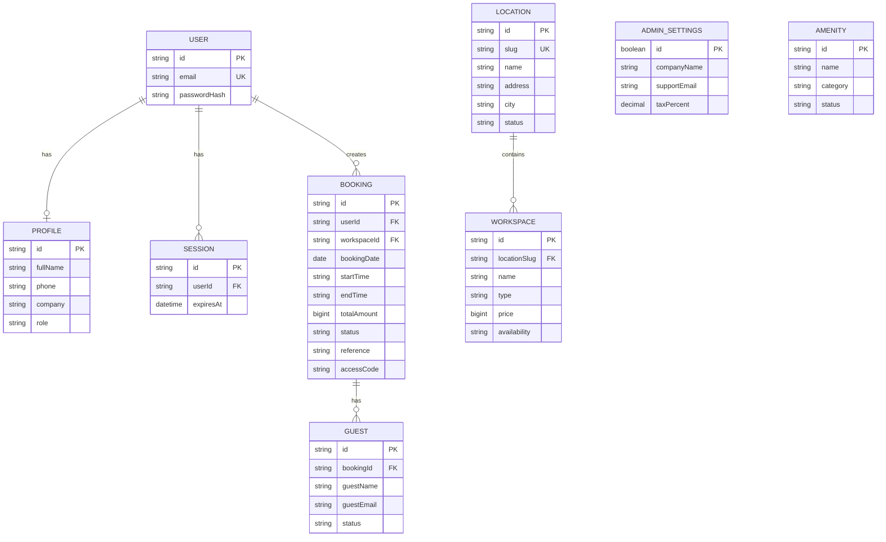

# TerraSpace Backend Specification

## 1. Backend Stack

- TypeScript
- TanStack Start / Nitro
- PostgreSQL
- Prisma ORM
- Zod
- Session-based Authentication

## 2. Backend Architecture

**Selected:** Modular Monolith with Layered Architecture.

The backend is organized by business modules while separating HTTP handling, business logic, and database access.

### Why

- Easy to understand and maintain
- Clear separation of concerns
- Scalable for new features
- Simple development and deployment
- Avoids unnecessary Microservices complexity
- Can be migrated to Microservices later if required

## 3. ERD

The backend database uses **PostgreSQL with Prisma ORM**.



## 4. Project Structure

```text
backend/
├── modules/
│   ├── auth/
│   ├── users/
│   ├── locations/
│   ├── workspaces/
│   ├── bookings/
│   ├── guests/
│   ├── payments/
│   ├── membership/
│   └── analytics/
├── middleware/
├── config/
├── database/
└── app.ts
```

Each module may contain:

```text
module/
├── routes/
├── controller/
├── service/
├── repository/
└── schemas/
```

## 5. Architecture Layers

Each module follows:

```text
Routes
   ↓
Controller
   ↓
Service
   ↓
Repository
   ↓
PostgreSQL
```

### Routes

Handle API endpoints and request routing.

### Controller

Handles HTTP requests and responses.

### Service

Contains business logic and application rules.

### Repository

Handles database operations through Prisma.

## 6. Database

Use **PostgreSQL** with **Prisma ORM**.

Prisma is responsible for:

- Database access
- Relations
- Type-safe queries
- Migrations

Business logic should not be placed directly inside database queries.

## 7. Validation & Security

- Use Zod for server-side request validation.
- Validate all external input.
- Use session-based authentication.
- Enforce authorization on the backend.
- Never trust frontend validation alone.
- Never expose passwords, secrets, or sensitive data.

## 8. Code Quality

- Keep controllers thin.
- Keep business logic inside services.
- Keep database access inside repositories.
- Avoid duplicated business logic.
- Keep custom files generally under **400 lines**.
- Reuse existing utilities.
- Use ESLint and Prettier.

## 9. Upgrade Strategy

New functionality should be added as isolated modules:

```text
modules/
├── booking/
├── workspace/
├── payment/
├── membership/
└── access-control/
```

This allows the backend to grow without significantly affecting existing modules.

## 10. Architecture Decision

**Modular Monolith + Layered Architecture**

Goals:

- Maintainable
- Scalable
- Testable
- Easy to extend
- Low coupling
- Simple deployment
- Avoid over-engineering

Microservices are not required at the current stage.
