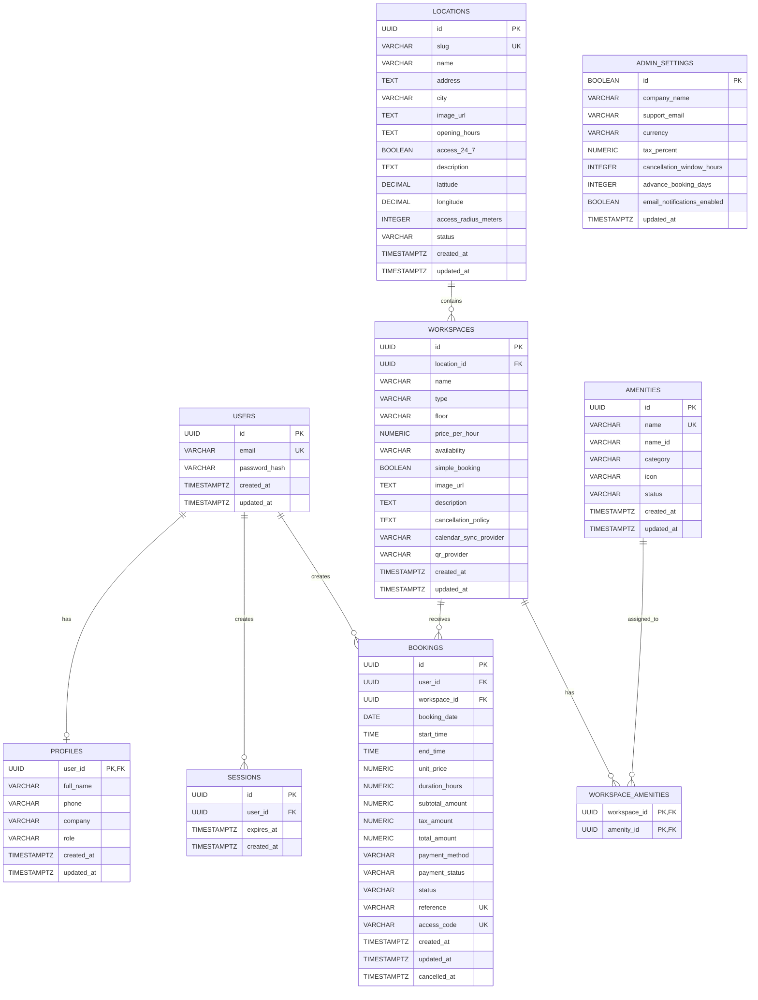

# TerraSpace Booking System — Detailed ERD Specification

> **Scope:** Workspace booking system based on the provided TerraSpace mockup and the current project structure in the uploaded ZIP.
>
> **Database target:** PostgreSQL.
>
> **Important scope decision:** The `GUEST` table is intentionally removed. The current mockup contains a guest-input UI, but guest management is not included in the target database model requested for this revision. The corresponding guest persistence/API logic should therefore be removed or disabled when the backend is aligned with this ERD.

---

## 1. Overview

The booking system follows this core business flow:

```text
User
  │
  ├── Profile
  │
  └── Session
       │
       ▼
Browse Location
       │
       ▼
Select Workspace
       │
       ▼
Select Booking Date
       │
       ▼
Check Workspace Availability
       │
       ▼
Select Start Time + End Time
       │
       ▼
Calculate Booking Price
       │
       ▼
Select Payment Method
       │
       ▼
Create Booking
       │
       ├── Booking Reference
       ├── Access Code / QR Pass
       └── Booking Status
       │
       ▼
Booking Confirmation
       │
       ▼
My Account
  ├── View Booking
  ├── Cancel Booking
  ├── View QR Access
  └── Smart Door Access
```

### Main domain concepts

The revised model separates the system into four logical areas:

1. **Identity**
   - `users`
   - `profiles`
   - `sessions`

2. **Workspace Catalog**
   - `locations`
   - `workspaces`
   - `amenities`
   - `workspace_amenities`

3. **Booking Transaction**
   - `bookings`

4. **System Configuration**
   - `admin_settings`

The booking transaction itself is intentionally kept focused. A booking belongs to exactly one user and one workspace. Availability is derived from existing bookings for the selected workspace/date/time rather than being stored as a separate booking-slot table.

---

# 2. Overall ERD



---

# 3. Relationship Rules

| Relationship | Cardinality | Meaning |
|---|---:|---|
| `USERS → PROFILES` | 1 : 0..1 | A user may have one profile. |
| `USERS → SESSIONS` | 1 : N | A user can have multiple active/login sessions. |
| `USERS → BOOKINGS` | 1 : N | A user can create multiple bookings. |
| `LOCATIONS → WORKSPACES` | 1 : N | A location contains multiple workspaces. |
| `WORKSPACES → BOOKINGS` | 1 : N | A workspace can receive many bookings across different dates/times. |
| `WORKSPACES → AMENITIES` | N : N | A workspace can have many amenities and an amenity can belong to many workspaces. |
| `BOOKINGS → GUESTS` | **Removed** | Guest persistence is intentionally out of scope. |
| `BOOKINGS → PAYMENTS` | **Not separate in current scope** | Current mockup stores payment method/status at booking level. A dedicated payment table can be introduced when a real payment gateway/transaction lifecycle is required. |

---

# 4. Table: `users`

## Purpose

Stores the authentication identity of each customer/user.

This table should contain only account/authentication information. Personal profile information belongs in `profiles`.

## Columns

| Column | PostgreSQL type | Null | Default | Constraint / purpose |
|---|---|---:|---|---|
| `id` | `UUID` | NO | `gen_random_uuid()` | PK |
| `email` | `VARCHAR(255)` | NO | - | UNIQUE; normalized lowercase |
| `password_hash` | `VARCHAR(255)` | NO | - | Stores password hash, never plaintext |
| `created_at` | `TIMESTAMPTZ` | NO | `now()` | Creation timestamp |
| `updated_at` | `TIMESTAMPTZ` | NO | `now()` | Last update timestamp |

## Constraints

- `PRIMARY KEY (id)`
- `UNIQUE (email)`
- `email` must not be empty.
- Email should be normalized to lowercase before persistence.
- `password_hash` must never contain a plaintext password.

## Indexing

1. `PRIMARY KEY (id)` — automatically indexed.
2. `UNIQUE INDEX (email)` — supports login lookup.

---

# 5. Table: `profiles`

## Purpose

Stores user-facing profile information used by the account/dashboard experience.

## Columns

| Column | PostgreSQL type | Null | Default | Constraint / purpose |
|---|---|---:|---|---|
| `user_id` | `UUID` | NO | - | PK + FK to `users.id` |
| `full_name` | `VARCHAR(150)` | NO | `''` | User's display name |
| `phone` | `VARCHAR(30)` | YES | `NULL` | Contact number |
| `company` | `VARCHAR(150)` | YES | `NULL` | Company/organization |
| `role` | `VARCHAR(30)` | NO | `'customer'` | `customer`, `staff`, `admin` |
| `created_at` | `TIMESTAMPTZ` | NO | `now()` | Creation timestamp |
| `updated_at` | `TIMESTAMPTZ` | NO | `now()` | Last update timestamp |

## Constraints

- `PRIMARY KEY (user_id)`
- `FOREIGN KEY (user_id) REFERENCES users(id) ON DELETE CASCADE`
- `role` should be restricted to the supported application roles.
- `full_name` should not be blank after validation.

## Indexing

1. `PRIMARY KEY (user_id)` — automatically indexed.
2. Optional index on `role` if admin/staff filtering becomes frequent.

---

# 6. Table: `sessions`

## Purpose

Stores authenticated sessions associated with a user.

## Columns

| Column | PostgreSQL type | Null | Default | Constraint / purpose |
|---|---|---:|---|---|
| `id` | `UUID` | NO | `gen_random_uuid()` | PK |
| `user_id` | `UUID` | NO | - | FK to `users.id` |
| `expires_at` | `TIMESTAMPTZ` | NO | - | Session expiry |
| `created_at` | `TIMESTAMPTZ` | NO | `now()` | Session creation |

## Constraints

- `PRIMARY KEY (id)`
- `FOREIGN KEY (user_id) REFERENCES users(id) ON DELETE CASCADE`
- `expires_at > created_at` should be enforced by application/database validation.

## Indexing

1. `PRIMARY KEY (id)` — automatically indexed.
2. `INDEX (user_id)` — retrieve sessions belonging to a user.
3. `INDEX (expires_at)` — useful for cleanup of expired sessions.

---

# 7. Table: `locations`

## Purpose

Represents a physical TerraSpace venue/branch.

The mockup uses location information for browsing, workspace discovery, address display, map/location information, opening hours, and smart-door radius configuration.

## Columns

| Column | PostgreSQL type | Null | Default | Constraint / purpose |
|---|---|---:|---|---|
| `id` | `UUID` | NO | `gen_random_uuid()` | PK |
| `slug` | `VARCHAR(100)` | NO | - | Public unique identifier |
| `name` | `VARCHAR(150)` | NO | - | Location name |
| `address` | `TEXT` | NO | - | Full address |
| `city` | `VARCHAR(100)` | NO | - | City |
| `image_url` | `TEXT` | YES | `NULL` | Location image |
| `opening_hours` | `TEXT` | NO | default | Display opening hours |
| `access_24_7` | `BOOLEAN` | NO | `false` | Whether access is 24/7 |
| `description` | `TEXT` | NO | `''` | Location description |
| `latitude` | `NUMERIC(9,6)` | YES | `NULL` | Venue latitude |
| `longitude` | `NUMERIC(9,6)` | YES | `NULL` | Venue longitude |
| `access_radius_meters` | `INTEGER` | NO | `50` | Smart-door geofence radius |
| `status` | `VARCHAR(20)` | NO | `'active'` | Catalog status |
| `created_at` | `TIMESTAMPTZ` | NO | `now()` | Creation timestamp |
| `updated_at` | `TIMESTAMPTZ` | NO | `now()` | Last update timestamp |

## Constraints

- `PRIMARY KEY (id)`
- `UNIQUE (slug)`
- `latitude` must be between `-90` and `90` when present.
- `longitude` must be between `-180` and `180` when present.
- `access_radius_meters > 0`
- `status` should be `active` or `inactive`.
- Location should not be deleted if historical bookings need to retain the venue reference. Prefer soft deactivation through `status`.

## Indexing

1. `PRIMARY KEY (id)` — automatically indexed.
2. `UNIQUE INDEX (slug)` — public route/catalog lookup.
3. Optional `INDEX (city, status)` — location listing/filtering.

---

# 8. Table: `workspaces`

## Purpose

Represents a bookable workspace within a location.

Examples include meeting rooms, private offices, hot desks, or other workspace types displayed in the mockup.

## Columns

| Column | PostgreSQL type | Null | Default | Constraint / purpose |
|---|---|---:|---|---|
| `id` | `UUID` | NO | `gen_random_uuid()` | PK |
| `location_id` | `UUID` | NO | - | FK to `locations.id` |
| `name` | `VARCHAR(150)` | NO | - | Workspace name |
| `type` | `VARCHAR(50)` | NO | - | Workspace category |
| `floor` | `VARCHAR(50)` | NO | `''` | Floor/level |
| `price_per_hour` | `NUMERIC(12,2)` | NO | `0` | Hourly catalog price |
| `availability` | `VARCHAR(20)` | NO | `'available'` | Catalog availability state |
| `simple_booking` | `BOOLEAN` | NO | `false` | Whether simplified booking flow is enabled |
| `image_url` | `TEXT` | YES | `NULL` | Workspace image |
| `description` | `TEXT` | NO | `''` | Workspace description |
| `cancellation_policy` | `TEXT` | NO | `''` | Displayed cancellation rule |
| `calendar_sync_provider` | `VARCHAR(50)` | YES | `NULL` | Optional calendar integration |
| `qr_provider` | `VARCHAR(50)` | YES | `NULL` | Optional QR/access provider |
| `created_at` | `TIMESTAMPTZ` | NO | `now()` | Creation timestamp |
| `updated_at` | `TIMESTAMPTZ` | NO | `now()` | Last update timestamp |

## Constraints

- `PRIMARY KEY (id)`
- `FOREIGN KEY (location_id) REFERENCES locations(id)`
- `price_per_hour >= 0`
- `availability` should be restricted to:
  - `available`
  - `limited`
  - `full`
  - `maintenance`
  - `disabled`
- `location_id` must reference an active/valid location for normal catalog publishing.
- Do not store `location_slug` as a foreign key. Use `location_id`.

## Indexing

1. `PRIMARY KEY (id)` — automatically indexed.
2. `INDEX (location_id)` — workspace listing by location.
3. `INDEX (location_id, availability)` — filter bookable workspaces by location.
4. Optional `INDEX (type, availability)` — workspace type filtering.

---

# 9. Table: `amenities`

## Purpose

Master/catalog table for workspace facilities such as Wi-Fi, projector, whiteboard, monitor, etc.

Amenities are catalog data and are not directly part of a booking transaction.

## Columns

| Column | PostgreSQL type | Null | Default | Constraint / purpose |
|---|---|---:|---|---|
| `id` | `UUID` | NO | `gen_random_uuid()` | PK |
| `name` | `VARCHAR(100)` | NO | - | Display name |
| `name_id` | `VARCHAR(100)` | YES | `NULL` | Indonesian/localized name |
| `category` | `VARCHAR(50)` | NO | `'General'` | Amenity category |
| `icon` | `VARCHAR(50)` | NO | `'tag'` | UI icon key |
| `status` | `VARCHAR(20)` | NO | `'active'` | Catalog status |
| `created_at` | `TIMESTAMPTZ` | NO | `now()` | Creation timestamp |
| `updated_at` | `TIMESTAMPTZ` | NO | `now()` | Last update timestamp |

## Constraints

- `PRIMARY KEY (id)`
- `UNIQUE (name)` or a suitable unique business key.
- `status` should be `active` or `inactive`.
- `name` must not be empty.

## Indexing

1. `PRIMARY KEY (id)` — automatically indexed.
2. `UNIQUE INDEX (name)` — prevents duplicate master amenities.
3. Optional `INDEX (category, status)` — admin/catalog filtering.

---

# 10. Table: `workspace_amenities`

## Purpose

Junction table that normalizes the many-to-many relationship between workspaces and amenities.

The existing project stores amenities as a string array. For a relational production schema, a junction table is preferable because amenities are managed independently in the admin catalog.

## Columns

| Column | PostgreSQL type | Null | Default | Constraint / purpose |
|---|---|---:|---|---|
| `workspace_id` | `UUID` | NO | - | FK to `workspaces.id` |
| `amenity_id` | `UUID` | NO | - | FK to `amenities.id` |

## Constraints

- `PRIMARY KEY (workspace_id, amenity_id)`
- `FOREIGN KEY (workspace_id) REFERENCES workspaces(id) ON DELETE CASCADE`
- `FOREIGN KEY (amenity_id) REFERENCES amenities(id) ON DELETE RESTRICT`
- Duplicate workspace/amenity assignment is impossible because of the composite PK.

## Indexing

1. `PRIMARY KEY (workspace_id, amenity_id)` — supports workspace → amenities.
2. `INDEX (amenity_id, workspace_id)` — supports amenity → workspaces.

---

# 11. Table: `bookings`

## Purpose

Core transaction table.

A booking represents a reservation made by an authenticated user for one workspace at one date and time range.

This table is the most important table in the booking system.

## Columns

| Column | PostgreSQL type | Null | Default | Constraint / purpose |
|---|---|---:|---|---|
| `id` | `UUID` | NO | `gen_random_uuid()` | PK |
| `user_id` | `UUID` | NO | - | FK to `users.id` |
| `workspace_id` | `UUID` | NO | - | FK to `workspaces.id` |
| `booking_date` | `DATE` | NO | - | Reservation date |
| `start_time` | `TIME(0)` | NO | - | Start time |
| `end_time` | `TIME(0)` | NO | - | End time |
| `unit_price` | `NUMERIC(12,2)` | NO | `0` | Price snapshot at booking time |
| `duration_hours` | `NUMERIC(6,2)` | NO | `0` | Calculated duration |
| `subtotal_amount` | `NUMERIC(14,2)` | NO | `0` | Before tax |
| `tax_amount` | `NUMERIC(14,2)` | NO | `0` | Tax amount |
| `total_amount` | `NUMERIC(14,2)` | NO | `0` | Final amount |
| `payment_method` | `VARCHAR(30)` | NO | `'card'` | Selected payment method |
| `payment_status` | `VARCHAR(20)` | NO | `'pending'` | Payment state |
| `status` | `VARCHAR(20)` | NO | `'confirmed'` | Booking lifecycle state |
| `reference` | `VARCHAR(50)` | NO | - | Human-readable booking reference |
| `access_code` | `VARCHAR(255)` | NO | - | QR/smart-access payload |
| `created_at` | `TIMESTAMPTZ` | NO | `now()` | Creation timestamp |
| `updated_at` | `TIMESTAMPTZ` | NO | `now()` | Last update timestamp |
| `cancelled_at` | `TIMESTAMPTZ` | YES | `NULL` | Cancellation timestamp |

## Constraints

### Primary / foreign keys

- `PRIMARY KEY (id)`
- `FOREIGN KEY (user_id) REFERENCES users(id)`
- `FOREIGN KEY (workspace_id) REFERENCES workspaces(id)`

### Unique constraints

- `UNIQUE (reference)`
- `UNIQUE (access_code)` if access codes are globally unique.

### Time constraints

- `start_time < end_time`
- Minimum booking duration: **30 minutes**.
- Booking must not cross midnight in the current model.
- The selected workspace must be bookable when the booking is created.

### Amount constraints

- `unit_price >= 0`
- `duration_hours > 0`
- `subtotal_amount >= 0`
- `tax_amount >= 0`
- `total_amount >= 0`
- Recommended calculation:

```text
duration_hours = (end_time - start_time) / 60
subtotal = unit_price × duration_hours
tax = subtotal × tax_percent / 100
total = subtotal + tax
```

### Status constraints

Recommended booking status:

```text
pending
confirmed
cancelled
completed
```

Recommended payment status:

```text
pending
paid
failed
refunded
```

Recommended payment methods from the current mockup:

```text
card
ewallet
bank
```

The `credits`/membership payment option should remain disabled unless the membership feature is reintroduced.

### Cancellation

- A cancelled booking should retain its row for history/audit.
- Prefer updating `status = 'cancelled'` rather than deleting the booking.
- `cancelled_at` should be populated when status becomes `cancelled`.

## Booking overlap rule

The most important business constraint is preventing two active bookings from overlapping for the same workspace/date.

For a requested interval:

```text
requested_start < existing_end
AND requested_end > existing_start
```

If both are true, the intervals overlap.

For PostgreSQL, the recommended production implementation is an exclusion constraint using a timestamp range generated from `booking_date + start_time` and `booking_date + end_time`, or an equivalent transaction/locking strategy.

The application must treat only non-cancelled bookings as blocking availability.

## Indexing

1. `PRIMARY KEY (id)` — automatically indexed.
2. `UNIQUE INDEX (reference)` — lookup by booking reference.
3. `INDEX (user_id, booking_date DESC)` — My Account booking history.
4. `INDEX (workspace_id, booking_date)` — availability lookup for a workspace/date.
5. `INDEX (workspace_id, booking_date, start_time, end_time)` — overlap/availability queries.
6. `INDEX (status, booking_date)` — admin calendar and booking management.
7. Optional `INDEX (payment_status, created_at)` — payment/admin reporting.

> **Important:** The workspace/date/time index improves lookup but does not by itself guarantee no double booking. Concurrency-safe overlap protection must be implemented at the database transaction/constraint level.

---

# 12. Table: `admin_settings`

## Purpose

Stores global booking/business configuration used by the application.

This is a singleton configuration table rather than a normal multi-row entity.

## Columns

| Column | PostgreSQL type | Null | Default | Constraint / purpose |
|---|---|---:|---|---|
| `id` | `BOOLEAN` | NO | `true` | Singleton PK |
| `company_name` | `VARCHAR(150)` | NO | `'TerraSpace'` | Brand/company name |
| `support_email` | `VARCHAR(255)` | YES | `NULL` | Support contact |
| `currency` | `CHAR(3)` | NO | `'USD'` | ISO currency code |
| `tax_percent` | `NUMERIC(5,2)` | NO | `0` | Tax percentage |
| `cancellation_window_hours` | `INTEGER` | NO | `24` | Minimum cancellation notice |
| `advance_booking_days` | `INTEGER` | NO | `30` | Maximum booking horizon |
| `email_notifications_enabled` | `BOOLEAN` | NO | `true` | Notification setting |
| `updated_at` | `TIMESTAMPTZ` | NO | `now()` | Last update |

## Constraints

- `PRIMARY KEY (id)`
- `id` should always be `true`.
- `tax_percent >= 0 AND tax_percent <= 100`
- `cancellation_window_hours >= 0`
- `advance_booking_days >= 0`
- `currency` should contain a valid 3-letter ISO currency code.

## Indexing

1. `PRIMARY KEY (id)` — automatically indexed.

No additional indexes are required because this table is a singleton.

---

# 13. Removed Tables / Fields

## 13.1 `guest` — REMOVED

The original ERD contained:

```text
BOOKING 1 ─── N GUEST
```

This is intentionally removed.

### Reason

The requested booking-system ERD does not include a guest entity, and the core booking transaction only requires the authenticated booking owner.

The current frontend ZIP still contains:

- guest input on booking review
- guest CRUD API
- admin guest management

Those are implementation remnants and should be removed/disabled when implementing this revised ERD.

### Required code alignment

Remove or refactor:

```text
Guest Prisma model
guest CRUD API
admin guest page
booking.create guests[] payload
guest-related frontend state
guest-related booking validation
```

If guest invitations become a future requirement, add the feature back as a separate domain instead of keeping an unused table in the core ERD.

---

## 13.2 `locationSlug` as a Workspace FK — REMOVED

The previous model used:

```text
WORKSPACE.locationSlug → LOCATION.slug
```

Recommended replacement:

```text
WORKSPACE.location_id → LOCATIONS.id
```

### Reason

A relational FK should normally reference the stable primary key rather than a mutable/public URL identifier.

`slug` remains useful for URLs such as:

```text
/locations/jakarta
```

but it should not be the primary relational key.

---

## 13.3 Workspace string arrays — NORMALIZED

The previous model used:

```text
WORKSPACE.amenities String[]
WORKSPACE.slots String[]
LOCATION.amenities String[]
```

### Recommendation

Remove these relationally meaningful arrays.

For amenities:

```text
WORKSPACES
    │
    └── WORKSPACE_AMENITIES
             │
             └── AMENITIES
```

### `slots`

A separate slot table is **not required** for the current booking flow.

The mockup allows users to select arbitrary start/end times and checks existing bookings for overlap. Therefore availability can be derived from:

```text
booking_date
start_time
end_time
workspace_id
status
```

A slot table should only be introduced if the product later changes to fixed predefined slots.

---

# 14. Why There Is No Separate Availability Table

A workspace does not need a persistent `availability_slots` table for the current system.

Availability is dynamic:

```text
Workspace
+
Selected Date
+
Requested Start Time
+
Requested End Time
+
Existing Active Bookings
=
Available / Unavailable
```

Example:

```text
Workspace A
2026-09-10

09:00 ───── 10:30  BOOKED
10:30 ───── 12:00  AVAILABLE
12:00 ───── 13:00  BOOKED
13:00 ───── 17:00  AVAILABLE
```

This matches the current mockup's behavior where the selected workspace/date is checked against booking intervals.

---

# 15. Why There Is No Separate Payment Table in the Current Version

The current mockup exposes payment methods and an admin payment view, but the current data model treats payment information as part of the booking:

```text
BOOKING
├── payment_method
├── payment_status
└── total_amount
```

This is sufficient if payment is only a booking attribute and the system does not yet store gateway transaction details.

A dedicated `payments` table should be introduced when the application needs:

- payment gateway transaction IDs
- provider-specific references
- payment attempts/retries
- webhook events
- refund records
- multiple payments per booking
- detailed payment audit history

For the current booking-system scope, adding that table would increase complexity without a corresponding requirement.

---

# 16. Data Type Recommendations

The revised schema intentionally changes several types from the original ERD.

| Data | Recommended type | Reason |
|---|---|---|
| Primary IDs | `UUID` | Stable distributed identifiers and avoids sequential public IDs |
| Email | `VARCHAR(255)` | Standard bounded email storage |
| Password hash | `VARCHAR(255)` | Supports modern password-hash formats |
| Date | `DATE` | Booking has a calendar date independent of timestamp |
| Start/end time | `TIME(0)` | Time-only values are more semantically correct than strings |
| Money | `NUMERIC(12,2)` / `NUMERIC(14,2)` | Exact currency arithmetic; avoid floating point |
| Tax | `NUMERIC(5,2)` | Supports percentages such as `11.00` |
| Coordinates | `NUMERIC(9,6)` | More predictable precision than generic float for persisted coordinates |
| Boolean settings | `BOOLEAN` | Native PostgreSQL boolean |
| Timestamps | `TIMESTAMPTZ` | Time-zone-aware event timestamps |
| Description/address | `TEXT` | Variable-length content |
| Status/type | `VARCHAR` + CHECK/enum rule | Flexible while still constrained |

---

# 17. Booking Flow Mapped to Database Operations

## Step 1 — Authentication

```text
users
  ↓
sessions
```

The authenticated session identifies `users.id`.

---

## Step 2 — Browse locations

Read:

```text
locations
```

Filter:

```text
status = 'active'
```

---

## Step 3 — Browse workspaces

Read:

```text
workspaces
```

using:

```text
workspace.location_id = location.id
```

and normally filter:

```text
availability NOT IN ('disabled', 'maintenance', 'full')
```

---

## Step 4 — Select date and time

User selects:

```text
booking_date
start_time
end_time
```

---

## Step 5 — Check availability

Query `bookings` by:

```text
workspace_id
booking_date
status
start_time
end_time
```

Only active/blocking statuses should participate in overlap detection.

---

## Step 6 — Calculate price

Use:

```text
workspaces.price_per_hour
```

as the catalog price.

At booking creation, copy the current price into:

```text
bookings.unit_price
```

This creates a **price snapshot** so historical bookings do not change when the workspace's current price changes.

---

## Step 7 — Select payment method

Current supported values:

```text
card
ewallet
bank
```

Store:

```text
booking.payment_method
booking.payment_status
```

---

## Step 8 — Create booking

Create:

```text
bookings
```

with:

```text
user_id
workspace_id
booking_date
start_time
end_time
unit_price
duration_hours
subtotal_amount
tax_amount
total_amount
payment_method
payment_status
status
reference
access_code
```

The operation should be transactional and protected against concurrent overlapping bookings.

---

## Step 9 — Confirmation

The confirmation page reads the booking by its ID/reference and displays:

- workspace
- location
- date
- time
- duration
- payment method
- total
- booking reference
- QR/access code

---

## Step 10 — My Account

The dashboard queries:

```text
bookings
WHERE user_id = authenticated_user_id
ORDER BY booking_date DESC
```

The user can:

- view upcoming bookings
- view past bookings
- cancel eligible bookings
- display QR access
- use smart-door access for eligible bookings

---

# 18. Final Recommended Table Set

For the current TerraSpace booking system, the recommended database tables are:

| Table | Keep? | Role |
|---|---|---|
| `users` | YES | Authentication/account identity |
| `profiles` | YES | User profile |
| `sessions` | YES | Authentication sessions |
| `locations` | YES | Physical venue |
| `workspaces` | YES | Bookable resources |
| `amenities` | YES | Workspace facility catalog |
| `workspace_amenities` | YES | Workspace ↔ amenity relation |
| `bookings` | **YES — CORE** | Booking transaction |
| `admin_settings` | YES | Global booking/business configuration |
| `guests` | **NO** | Explicitly removed |
| `availability_slots` | NO | Not needed for arbitrary start/end booking |
| `payments` | NO for current scope | Add later if real payment transaction lifecycle is implemented |

---

# 19. Recommended Final Relationship Model

The cleanest core relationship is:

```text
                         ┌──────────────┐
                         │    USERS     │
                         └──────┬───────┘
                                │
                ┌───────────────┼───────────────┐
                │               │               │
                ▼               ▼               ▼
          ┌──────────┐    ┌───────────┐   ┌───────────┐
          │ PROFILES │    │ SESSIONS  │   │ BOOKINGS  │
          └──────────┘    └───────────┘   └─────┬─────┘
                                                │
                                                │ N:1
                                                ▼
                                         ┌─────────────┐
                                         │ WORKSPACES  │
                                         └──────┬──────┘
                                                │
                                                │ N:1
                                                ▼
                                         ┌─────────────┐
                                         │ LOCATIONS   │
                                         └─────────────┘

WORKSPACES
     │
     │ N:M
     ▼
┌────────────────────┐
│ WORKSPACE_AMENITIES│
└─────────┬──────────┘
          │
          ▼
     ┌───────────┐
     │ AMENITIES │
     └───────────┘
```

This model keeps the booking domain simple:

```text
USER
  ↓
BOOKING
  ↓
WORKSPACE
  ↓
LOCATION
```

while catalog relationships remain separate:

```text
WORKSPACE
  ↕
AMENITY
```

and authentication remains separate:

```text
USER
 ├── PROFILE
 └── SESSION
```

---

# 20. Implementation Alignment Checklist

Before implementing the revised ERD in Prisma/backend:

- [ ] Remove `Guest` model.
- [ ] Remove guest CRUD server functions.
- [ ] Remove guest admin UI/API dependencies.
- [ ] Remove `guests[]` from `createBooking`.
- [ ] Change `Workspace.locationSlug` to `Workspace.locationId`.
- [ ] Change booking `startTime` / `endTime` from strings to PostgreSQL `TIME`.
- [ ] Change monetary fields from integer/BigInt representation to `NUMERIC`.
- [ ] Add booking price snapshots (`unit_price`, subtotal, tax, total).
- [ ] Add `payment_status` separately from `payment_method`.
- [ ] Normalize workspace amenities with `workspace_amenities`.
- [ ] Remove redundant `Location.amenities`.
- [ ] Remove `Workspace.slots` for the current arbitrary-time booking model.
- [ ] Add indexes required for booking availability queries.
- [ ] Implement concurrency-safe overlap protection.
- [ ] Keep cancelled bookings for historical/audit purposes.
- [ ] Use `location_id` rather than `location_slug` for relational integrity.
- [ ] Keep `slug` only as a public/catalog identifier.
- [ ] Consider a dedicated `payments` table only when real payment gateway transaction tracking is required.

---

## Final Recommendation

The original ERD is a useful starting point, but it mixes **authentication, catalog data, booking transaction data, and features that are not part of the requested booking domain**.

The revised model should use **9 tables**:

```text
users
profiles
sessions
locations
workspaces
amenities
workspace_amenities
bookings
admin_settings
```

The most important change is to make `bookings` the center of the transaction while keeping workspace/location data normalized:

```text
USER → BOOKING → WORKSPACE → LOCATION
```

There is **no `guest` table**, no separate availability-slot table, and no payment table in the current scope.

This provides a cleaner foundation for the backend API, Prisma schema, availability checking, booking creation, cancellation, admin booking management, and future payment/access integrations.
